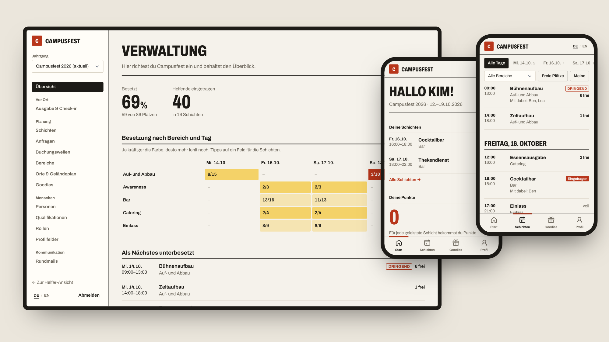

# Wichtel

**Das Helfer- und Schichtsystem für ehrenamtliche Festivals** – Helfende tragen sich auf dem Handy
in Schichten ein, sammeln Punkte für Goodies, und die Orga behält den Überblick.

_A volunteer and shift management system for non-profit festivals (German/English)._

<picture>
  <source media="(prefers-color-scheme: dark)" srcset="docs/images/overview-dark.png">
  
</picture>

## Was du bekommst

**Für Helfende** – ohne Anleitung benutzbar, gemacht fürs Handy

- Schichten nach Tagen durchsehen und mit einem Tipp eintragen; Überschneidungen werden verhindert
- Schichten abgeben oder tauschen, Warteliste, gemeinsam mit Freund\*innen eintragen
- Punkte sammeln und gegen Goodies tauschen – das Freiticket kommt automatisch zuerst
- Treffpunkte auf Geländeplan und Karte, Erinnerungen per E-Mail, Kalender-Abo

**Für Leitungen**

- Übersicht, wo noch Leute fehlen, mit Heatmap nach Bereich und Tag
- Schichten und ganze Serien in Minuten anlegen, Druckansichten für vor Ort
- Anfragen und Übergaben freigeben, Dringend-Aufruf per E-Mail, Check-in per QR-Code

**Für die Organisation**

- Bereiche, Rollen und Rechte frei konfigurierbar, vererbt im Bereichsbaum
- Buchungswellen, Punkte-Regeln, Goodies, Profilfelder, Farben und Logo – alles in der Oberfläche
- Jahrgang kopieren, Protokoll aller Änderungen, Deutsch und Englisch, Hell- und Dunkelmodus
- Optional: Planen mit KI-Assistenten wie Claude, immer mit den Rechten der jeweiligen Person

Die vollständige Liste steht in [docs/FUNKTIONEN.md](docs/FUNKTIONEN.md).

## Schnellstart

```bash
curl -O https://raw.githubusercontent.com/yniverz/wichtel/main/docker-compose.yml
curl -o .env https://raw.githubusercontent.com/yniverz/wichtel/main/.env.example
# in .env PUBLIC_URL und POSTGRES_PASSWORD setzen
docker compose up -d && docker compose logs app   # zeigt den Einrichtungslink
```

Portainer, Reverse Proxy, E-Mail und Sicherung: [docs/BETRIEB.md](docs/BETRIEB.md).

## Dokumentation

| Dokument                                 | Inhalt                                        |
| ---------------------------------------- | --------------------------------------------- |
| [Funktionen](docs/FUNKTIONEN.md)         | Alles, was Wichtel kann                       |
| [Betrieb](docs/BETRIEB.md)               | Installation, Konfiguration, Updates, Backups |
| [KI-Assistenten](docs/KI-ASSISTENTEN.md) | Claude & Co. anbinden (MCP)                   |
| [Entwicklung](docs/ENTWICKLUNG.md)       | Lokal starten, Tests, Aufbau des Codes        |
| [Konzept](docs/KONZEPT.md)               | Fachliches Modell und Entscheidungen          |
| [Design](docs/DESIGN.md)                 | Gestaltungsrichtlinien                        |

## Status

Alle geplanten Funktionen sind umgesetzt. Vor dem ersten echten Einsatz fehlen noch
Datenschutz-Funktionen (Auskunft und Löschung von Konten) und ein Testlauf unter Last.

## Lizenz

[GNU Affero General Public License v3.0](LICENSE) © The Wichtel contributors
